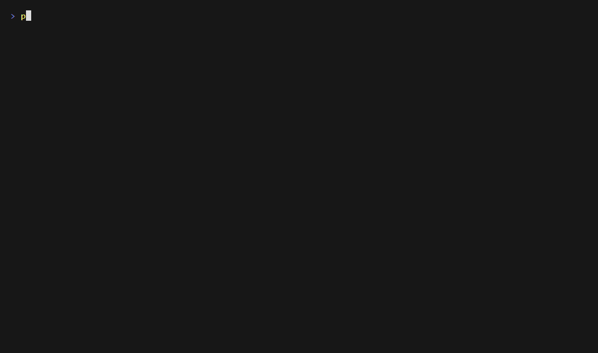

# ABCC 2.0 — Agent Battle Command Center

**Put a coding job on a board. A local model tries it in a scratch copy of your
repository, your real tests decide whether it lands, and you read the diff
before anything is committed.** The model never grades its own work. One Rust
binary, driving a model on your own machine.

```sh
git clone https://github.com/mrdushidush/abcc && cd abcc
cargo install --path crates/abcc --locked     # Rust stable
# Start an OpenAI-compatible server holding a model (LM Studio is what it is
# measured on, one 16 GB GPU), then, from a checkout of your own repository:
abcc check --model <the id your server reports>
abcc chat "make one() return two"
```



*`abcc chat` on a two-test toy repo: the model fixes a failing test in its own worktree, `/done` runs the checks, you read the diff, and `y` lands it. A real run on qwen3.6-35b-a3b in LM Studio on a 16 GB card; pauses where the screen didn't change are trimmed.*

Under the hood: a durable SQLite event log, a gate built out of deterministic
refusals, and an RTS-framed terminal console.

> **Status: pre-alpha.** It is public so that it can be read, not because it is
> finished. Nothing here is released and nothing is packaged — it is not on
> crates.io. Every measurement behind it was taken on one Windows machine against
> one local model; CI builds and tests it on Linux and Windows. Issues are
> welcome; issues labelled
> [`pr-welcome`](https://github.com/mrdushidush/abcc/labels/pr-welcome) are
> open for a pull request — [`CONTRIBUTING.md`](CONTRIBUTING.md) has the rest.

## What it is

The operator gives the fleet repository work. A **slot** — a resident model plus
a tool policy — takes one **attempt** at a **task**, running Localize → Change →
Measure → Judge inside an isolated git worktree. Everything that happens is an
append-only event, the task board is a projection of that log, and restarting the
process reconstructs the board by replaying it.

Three commitments distinguish it from the thing it replaces, and each one came
out of measurement rather than taste:

- **A model verdict is a report and never a gate.** Only deterministic rungs may
  refuse. The Judge is shown the measurements and its opinion is written down for
  a human — it does not vote.
- **There is no `bool` in the outcome data.** A rung either produced a
  measurement the host watched, or it did not and says why. "The tests passed",
  "the tests all failed" and "there were no tests" are three different records,
  which is two more than the predecessor could tell apart.
- **The security posture is blast radius, not a sandbox**, and it is written in
  those words because Windows does not offer the other thing. Model-written code
  runs with your privileges. [`SECURITY.md`](SECURITY.md) is the whole of it —
  eleven rows, seven with a shipped control and **four carrying a dated
  admission**, one of which is only half closed.

## Using it, as far as it goes

**`CHEATSHEET.md` is the whole tool on one page** — start there. **`USING.md` is the
long-form runbook** — the five-word daily loop, what to do
when a task stalls, and how to write a task that lands. This section is the verb
list it rests on.

**The daily way in is `abcc chat`**, in a checkout of your own: you talk, the
model edits in a worktree, `/done` runs the repository's checks and shows the
diff, and `y` commits it. ⚠ **Only a repository the gate can check can land.**
The checks are found by witness file: a `Cargo.toml` (`cargo test`, plus
`cargo fmt --check` and `cargo clippy -D warnings` when there is a
`clippy.toml`) or a Python project (`pyproject.toml`, `setup.py`, `pytest.ini`
or `tox.ini`: `python -m pytest`). With neither, nothing can
measure the work, so nothing lands; the chat still edits and `/diff` still
shows it.

```
abcc where                       where this repository's log and worktrees live
abcc check                       ask the server which model it is holding
abcc chat "make one() return two"   work on it together: you talk, it edits
abcc task "make one() return two"   put a task on the board
abcc run --task t3               one attempt, Localize then Change
abcc board                       the board, from the projection
abcc diff t3                     what the attempt wrote, as a patch
abcc land t3                     a green attempt becomes a commit on this branch
abcc replay t3                   after-action: how a task got where it is
abcc watch                       the reader, over the event log alone
abcc accept t3 / abcc reject t3  the operator's two endings
abcc take t3 / abcc release t3   take the keyboard, and hand it back
abcc review t3 <minutes>         the measurement W13's ladder is defined in
abcc weights [--verify]          which bytes are behind the model you asked for
abcc --version                   the version of this binary
```

`abcc take t3` is *take over manually*, and it hands over a directory as well as
a state: the task goes `UNDER MANUAL CONTROL` and you get a worktree cut at its
last checkpoint — the work as the fleet left it. `abcc release t3` snapshots
what you did, takes the tree down and puts the task back on the board;
`abcc accept` and `abcc reject` end it and close the workspace on the way out.
It is refused while an attempt is flying, because that worktree belongs to a
driver that is still writing in it.

The log and the attempt worktrees live **outside** the repository, in a
per-checkout directory under the platform data directory; `abcc where` prints it
and `--home` moves it. `abcc run` needs an OpenAI-compatible server on
`ABCC_MODEL_BASE_URL` (default `http://127.0.0.1:1234`) and a model named by
`--model` or `ABCC_MODEL`.

🚨 **Two things it will not do**, and both are the design rather than a gap.
It **refuses to run against a model it cannot confirm the server is holding** —
LM Studio answers a request naming a model it does not have by using whichever
model *is* loaded, so set `ABCC_MODEL_FINGERPRINT` to a substring of the id the
server reports if the two do not match exactly. And **only a measurement says
`Accomplished`** — never the model. The driver runs the gate over the
before/after snapshot pair and reads a headline that is `Green` and nothing
else: every declared rung measured, none of them red. What the model says about
its own work is a `Claim`, and there is no function anywhere that turns one into
an outcome. An attempt no rung could measure ends `Uncertain` and asks a person,
which is what `abcc accept` answers.

## Relationship to ABCC v1

This is the successor to
[`agent-battle-command-center`](https://github.com/mrdushidush/agent-battle-command-center),
which keeps its own repository, its final Docker tag and its history. It is a
**new repository at a new slug**, not a branch or a major version, because a Rust
rewrite sharing a repository with a TypeScript/Python monorepo inherits a CI
configuration and a 575-line CONTRIBUTING that do not apply to it.

**None of v1's code is here.** 2.0 is a rewrite: the predecessors were read as a
specification and as a test corpus, their catalogued defects became test cases,
and the code was written fresh. **The one exception is claudette** — the same
author's code, under the same licence — from which three modules were ported
deliberately rather than rewritten: the conversation compaction
(`crates/abcc-engine/src/compact.rs`), the stale tool-result eviction
(`crates/abcc-engine/src/evict.rs`) and the chat line editor
(`crates/abcc/src/line_editor.rs`). Each names its source in its header and lists
what it changed. So it ships `MIT OR Apache-2.0` with no inherited-code caveat. The art, the audio and the
identity are David's own. ⚠ **They are not in this repository**: the sprite
corpus lives outside it and `abcc paint` is told where by `--sprites` or
`ABCC_SPRITES`, so a fresh clone builds and runs but cannot draw the
battlefield until it is pointed at a corpus. See [`CREDITS.md`](CREDITS.md).

**There is no migration path from v1's database, and that is deliberate**: its
task rows carry no tokens, no cost and no labels. The corpora that were worth
keeping were extracted and are already running in 2.0's measurement harness.

## Where the reasoning lives

The architecture was not designed in this repository. It came out of a research
phase that produced thirteen workstream documents, two acceptance sweeps, a
signed-off summary and fourteen ADRs, and the measuring has not stopped since:
there are now 25 ADRs and 849 numbered findings. All of it is in
[**abcc-research**](https://github.com/mrdushidush/abcc-research), which is
where every claim in the source comments can be checked — its README says where
to start.

Source comments cite that work by finding id (`F146`), by workstream (`W3`) and
by decision record (`ADR-0004`). **A number in a comment is quoted from a named
finding**; if you cannot find the finding, treat the number as wrong.
In that repository, `python research/tools/fledger.py build` once, then
`python research/tools/fledger.py show F146`, prints one and says whether a later
finding corrected it.

## The family

| Repo | What it is |
|---|---|
| [claudette](https://github.com/mrdushidush/claudette) | **Use it today:** an air-gapped coding agent in one Rust binary, and Q56, a hidden-test benchmark for local models |
| **abcc** (this repo) | **What's next:** the board, the gate and the fleet. Pre-alpha |
| [abcc-research](https://github.com/mrdushidush/abcc-research) | **The evidence:** every measurement behind both, numbered and correctable |
| [agent-battle-command-center](https://github.com/mrdushidush/agent-battle-command-center) | Where it started: v1, TypeScript, RTS-style UI. Stable, in maintenance |

## Licence

`MIT OR Apache-2.0`, at your option.
